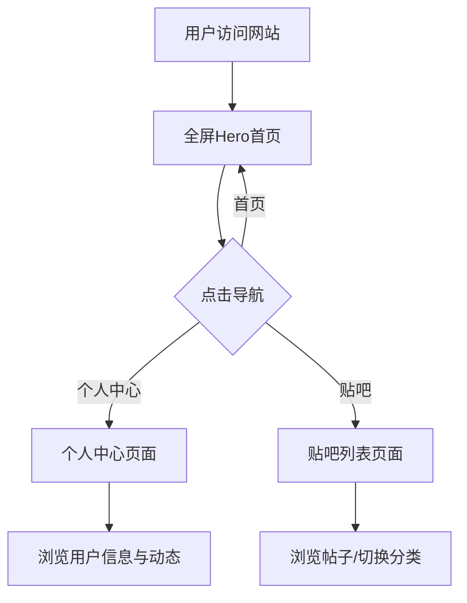

## 1. 产品概述

构建一个面向PC端的科技感社交平台，以暗色系为主基调，融合粒子动画与流体渐变背景，打造"高级、克制、富有科技感"的视觉体验。目标用户为追求品质化社交体验的科技爱好者与年轻群体。

## 2. 核心功能

### 2.1 用户角色

| 角色 | 注册方式 | 核心权限 |
|------|----------|----------|
| 普通用户 | 无需注册（预览版） | 浏览首页、查看贴吧、访问个人中心 |

### 2.2 功能模块

1. **全屏Hero首页**：粒子动画背景、视频背景层、高斯模糊暗色遮罩、大标题、导航栏、联系按钮
2. **个人中心**：用户信息卡片、动态列表、数据统计面板
3. **贴吧（论坛）**：帖子列表、分类标签、热门讨论区、发帖入口

### 2.3 页面详情

| 页面名称 | 模块名称 | 功能描述 |
|----------|----------|----------|
| 首页 | Hero区域 | 全屏视口，CSS粒子动画 + 渐变流体背景，暗色高斯模糊遮罩，大标题"连接未来"，副标题，CTA按钮 |
| 首页 | 导航栏 | 固定顶部透明导航，滚动后变为毛玻璃效果，Logo + 首页/个人中心/贴吧/关于 链接 |
| 首页 | 特色区域 | 三列卡片展示平台核心特色（实时互动、智能推荐、隐私安全） |
| 个人中心 | 用户信息卡 | 头像、用户名、简介、关注/粉丝数、编辑资料按钮 |
| 个人中心 | 数据面板 | 发帖数、获赞数、收藏数统计卡片 |
| 个人中心 | 动态时间线 | 用户最近活动列表，带时间戳 |
| 贴吧 | 分类导航 | 横向标签切换：全部/技术/生活/游戏/影视 |
| 贴吧 | 帖子列表 | 卡片式帖子列表，含标题、作者、回复数、发布时间 |
| 贴吧 | 热门讨论 | 侧边栏热门话题排行 |

## 3. 核心流程

## 4. 用户界面设计

### 4.1 设计风格

- **主色调**：深邃黑底 `#0a0a0f`，辅助色 `#111118`、`#1a1a24`
- **点缀色**：冷色系 — 青蓝 `#06b6d4`（Cyan）、靛蓝 `#6366f1`（Indigo）、翠绿 `#10b981`（Emerald）
- **文字色**：主文字 `#e2e8f0`，次要文字 `#94a3b8`，暗淡文字 `#475569`
- **按钮风格**：圆角半透明玻璃态，悬停时发光边框
- **字体**：标题使用 `Geist` 或 `Orbitron`（科技感），正文使用系统默认无衬线字体
- **布局**：内容区最大宽度 `1700px`，居中自适应
- **图标**：Lucide React 线性图标，统一 `strokeWidth={1.5}`

### 4.2 页面设计概览

| 页面名称 | 模块名称 | UI元素 |
|----------|----------|--------|
| 首页 | 导航栏 | 固定顶部，透明→毛玻璃渐变，Logo左对齐，链接居中，右侧CTA按钮 |
| 首页 | Hero | 全屏，粒子Canvas背景 + 渐变流体叠加，中央大标题带渐入动画，副标题，两个CTA按钮 |
| 首页 | 特色卡片 | 三列网格，玻璃态卡片，图标+标题+描述，悬停发光边框 |
| 个人中心 | 信息卡 | 左侧头像+信息，右侧统计数字，背景渐变光晕 |
| 个人中心 | 动态列表 | 时间线样式，左侧竖线+圆点，右侧内容卡片 |
| 贴吧 | 分类标签 | 水平滚动标签栏，选中态高亮下划线 |
| 贴吧 | 帖子卡片 | 列表布局，左侧头像，右侧标题+元信息，悬停背景微亮 |

### 4.3 响应式

- 桌面优先设计，主内容区 `max-w-[1700px]`
- 断点：`< 1280px` 时适当缩小间距，卡片由3列变2列
- 断点：`< 768px` 时移动端适配，导航折叠为汉堡菜单

### 4.4 动画效果

- Hero区域：粒子动画持续流动，标题文字逐字渐入（Framer Motion stagger）
- 导航栏：滚动触发毛玻璃过渡
- 卡片：进入视口时从下方淡入上移（whileInView）
- 按钮：hover时发光边框扩散动画
- 页面切换：Route级别淡入淡出过渡