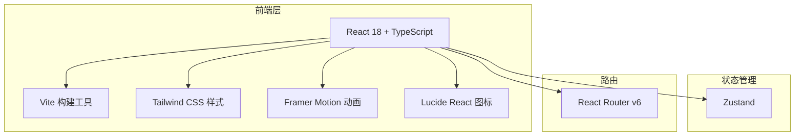

## 1. 架构设计



纯前端单页应用，无后端依赖，所有数据使用 Mock 数据。

## 2. 技术说明

- **前端框架**：React 18 + TypeScript
- **构建工具**：Vite 5
- **样式方案**：Tailwind CSS 3
- **动画库**：Framer Motion 11
- **图标库**：Lucide React
- **状态管理**：Zustand
- **路由**：React Router v6
- **初始化工具**：vite-init（react-ts 模板）

## 3. 路由定义

| 路由 | 页面组件 | 描述 |
|------|----------|------|
| `/` | HomePage | 全屏Hero首页 + 特色卡片区域 |
| `/profile` | ProfilePage | 个人中心：用户信息、动态、数据统计 |
| `/forum` | ForumPage | 贴吧：帖子列表、分类筛选、热门讨论 |

## 4. 组件树

```
App
├── Navbar（全局导航栏）
│   ├── Logo
│   ├── NavLinks
│   └── CTA Button
├── Routes
│   ├── HomePage
│   │   ├── HeroSection（全屏Hero）
│   │   │   ├── ParticleBackground（Canvas粒子动画）
│   │   │   ├── GradientOverlay（渐变流体叠加层）
│   │   │   └── HeroContent（标题、副标题、按钮）
│   │   └── FeaturesSection（特色卡片三列）
│   │       └── FeatureCard × 3
│   ├── ProfilePage
│   │   ├── ProfileHeader（用户信息卡）
│   │   ├── StatsPanel（数据统计卡片）
│   │   └── Timeline（动态时间线）
│   └── ForumPage
│       ├── CategoryTabs（分类标签栏）
│       ├── PostList（帖子列表）
│       │   └── PostCard × N
│       └── HotTopics（热门讨论侧边栏）
└── Footer
```

## 5. 数据模型（Mock）

```typescript
// 用户
interface User {
  id: string;
  name: string;
  avatar: string;
  bio: string;
  followers: number;
  following: number;
  posts: number;
  likes: number;
  favorites: number;
}

// 帖子
interface Post {
  id: string;
  title: string;
  content: string;
  author: User;
  category: string;
  replies: number;
  views: number;
  createdAt: string;
  isHot: boolean;
}

// 动态
interface Activity {
  id: string;
  type: 'post' | 'like' | 'comment';
  content: string;
  timestamp: string;
}
```

## 6. Tailwind 配置

扩展自定义颜色：
- `cyber-black`: `#0a0a0f`
- `cyber-surface`: `#111118`
- `cyber-card`: `#1a1a24`
- `cyber-cyan`: `#06b6d4`
- `cyber-indigo`: `#6366f1`
- `cyber-emerald`: `#10b981`

自定义字体：导入 `Orbitron` 用于标题展示。